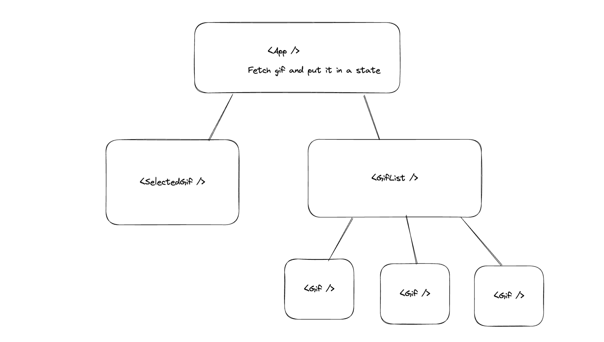

# Livecoding fetch Giphy API and demo of tailwind

What we are supposed to have :



Clone this repository and :

```shell
$ npm i
```

You'll need an [Giphy API key](https://developers.giphy.com/) to make it work properly.

When you have it, rename `.env.sample` file as `.env` and put your API key as value.

```shell
$ npm run dev
```
